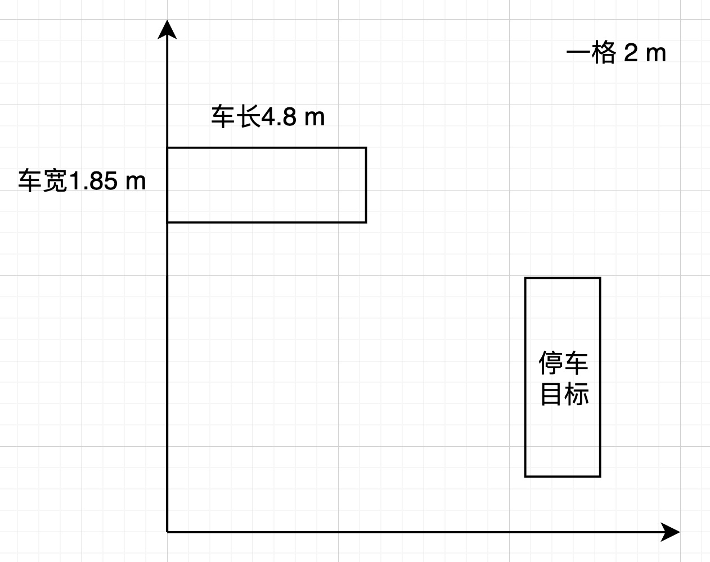
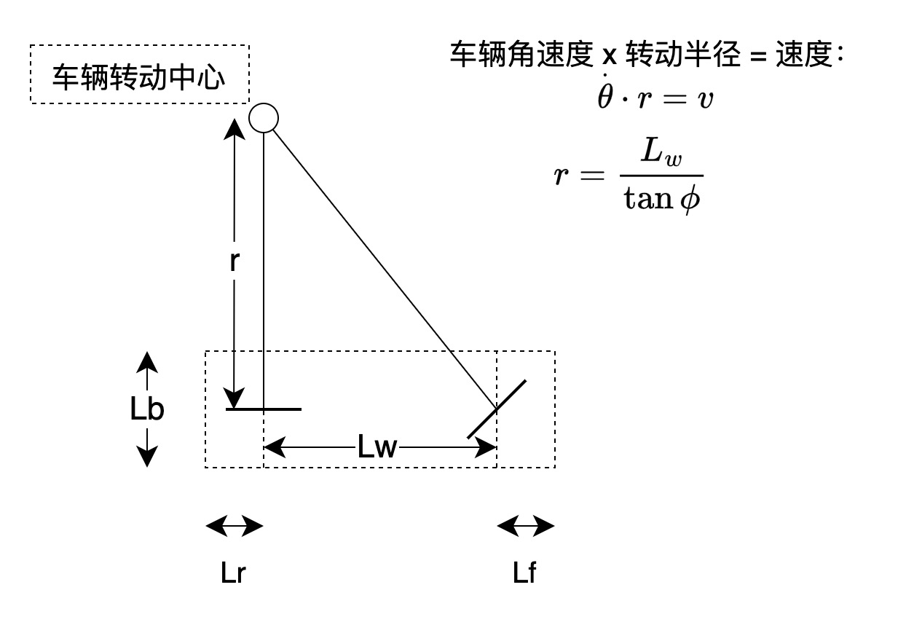
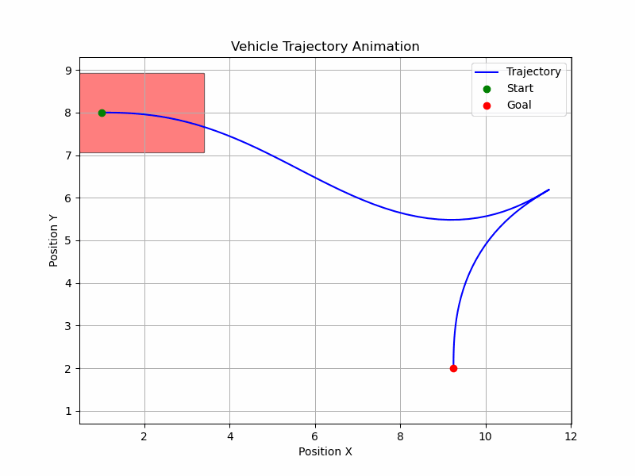
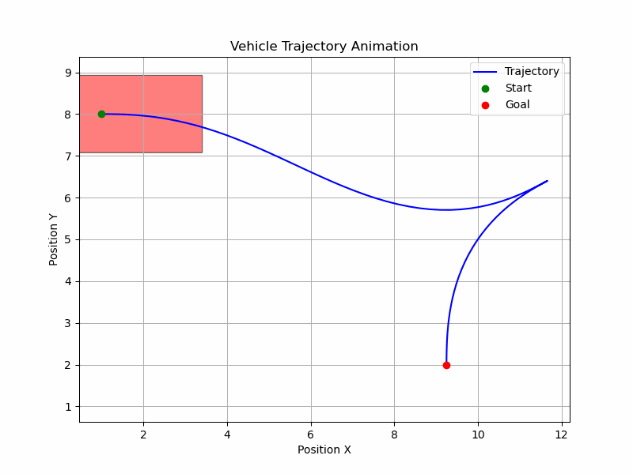
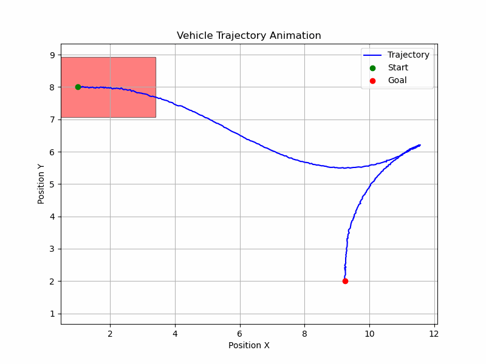
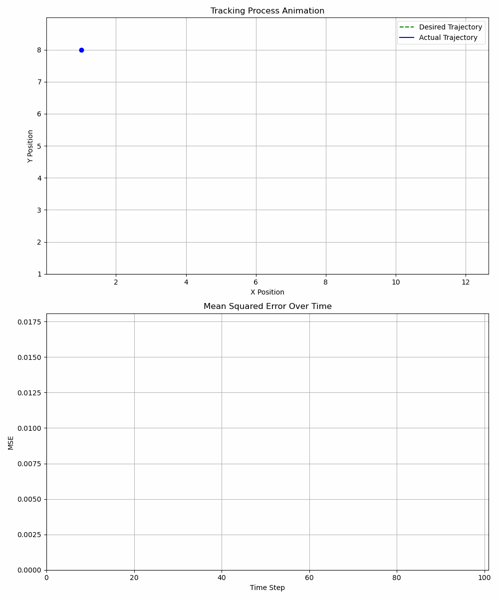

# Auto Parking Trajectory Optimization (HITSZ: Convex & Optimal Control, Fall 2024)

本项目基于哈尔滨工业大学（深圳）凸优化与最优控制研究生课程（2024 Fall）大作业“自动泊车轨迹优化”，完成了如下目标：

1. 将最优控制问题转为非线性规划问题并调用 IPOPT 求解器求解
2. 自编写增广 Lagrange-迭代 LQR 求解器求解最优控制问题
3. 状态方程添加噪声，利用滚动优化思想调用 IPOPT 求解器求解
4. 状态方程添加噪声，利用 AL-iLQR 跟踪已生成的轨迹

# 采用最优控制数值解求解无障碍物泊车问题

## 车辆参数

- **轴距**： `lw = 2.8`
- **前轮突出** 1 米：`lf = 1.0`
- **后轮突出** 1 米：`lr = 1.0`
- **车宽**：`lb = 1.85`
- **最大速度**: `vmax = 3.0`
- **最小速度**：`vmin = -2.0`
- **最大加速度**：`amax = 2.0`
- **最小加速度**：`amin = -1.0`
- **前轮最大转角**：`phi_max = 0.63792`  (36.55°)
- **方向盘最大转速**：`omega_max = 0.63792`

## 场景参数

  

## 状态方程离散化与容许控制

定义状态为：

$$
x(t) = \left[p_x(t), p_y(t), v(t), \phi(t), \theta(t)\right]^\top
$$

其中：
- $p_x, p_y$ 是车辆的位置
- $v$ 是车辆的速度
- $\phi$ 是方向盘的角度
- $\theta$ 是车辆的航向角

控制量为车辆加速度 $a$ 与方向盘角速度 $w$。

  

状态方程为：

$$
\dot{x}(t) = 
\begin{bmatrix}
v(t) \cos(\theta(t)) \\
v(t) \sin(\theta(t)) \\
a(t) \\
\omega(t) \\
\frac{v(t)\tan(\phi(t))}{L_w}
\end{bmatrix} = f(x(t), u(t))
$$

## 初值约束

$$
x_0 = \begin{bmatrix} 1.0 \\ 8.0 \\ 0.0 \\ 0.0 \\ 0.0 \end{bmatrix}
$$

## 末端约束 

$$
\begin{aligned}
x_N &= \begin{bmatrix} 9.25 \\ 2.0 \\ 0.0 \\ 0.0 \\ \frac{\pi}{2} \end{bmatrix} \\
u_N &= \begin{bmatrix} 0.0 \\ 0.0 \end{bmatrix}
\end{aligned}
$$

## 其他约束

- **速度限制**

  $$
  v_{min} \le v \le v_{max}
  $$

- **前轮转角限制**

  $$
  -\phi_{max} \le \phi \le \phi_{max}
  $$

- **容许控制**

  $$
  \begin{aligned}
  a_{min} &\le a \le a_{max}, \\
  -\omega_{max} &\le \omega \le \omega_{max}.
  \end{aligned}
  $$

## 目标函数

$$
J(u_1, u_2) = \int_{t_0}^{t_f} \left( u_1^2(t) + u_2^2(t) \right) \, \mathrm{d}t
$$

## 最终的最优控制问题

$$
\begin{aligned}
\min_{u} \quad & J(u_1(t), u_2(t)) = \int_{t_0}^{t_f} \left( u_1^2(t) + u_2^2(t) \right) \mathrm{d}t \\
\text{subject to} \quad & \dot{x}(t) = f(x(t), u(t)) \\
& x(t_0) = \begin{bmatrix} 1.0 \\ 8.0 \\ 0.0 \\ 0.0 \\ 0.0 \end{bmatrix} \\
& x(t_f) = \begin{bmatrix} 9.25 \\ 2.0 \\ 0.0 \\ 0.0 \\ \frac{\pi}{2} \end{bmatrix} \\
& u(t_f) = \begin{bmatrix} 0.0 \\ 0.0 \end{bmatrix} \\
& v_{min} \le v(t) \le v_{max} \\
& -\phi_{max} \le \phi(t) \le \phi_{max} \\
& a_{min} \le a(t) \le a_{max}, \\
& -\omega_{max} \le \omega(t) \le \omega_{max}.
\end{aligned}
$$

## 内容展示

### 1. IPOPT 求解

### 2. AL-iLQR 求解

### 3. 噪声下滚动优化

### 4. AL-iLQR 跟踪轨迹

